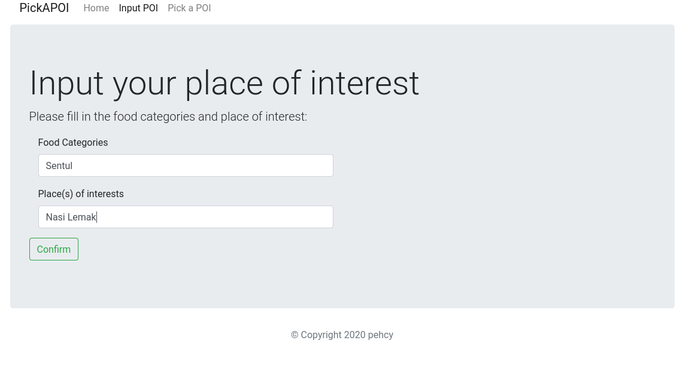
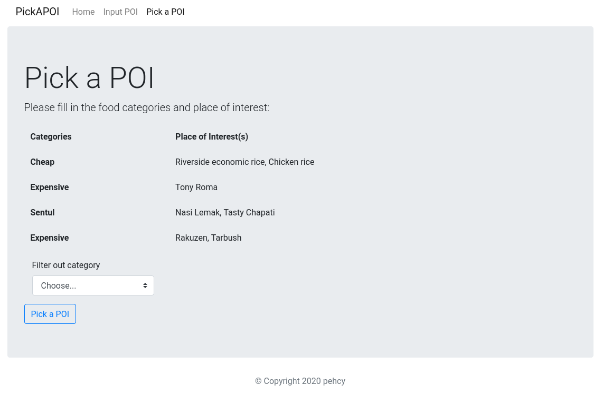

<h1>Pick a Poi - Node.js + Mongoose</h1>

**Note: This task is given by Appxplore company as an interview test.**

The Pick a POI is a food picker application for Appxplore company. 
You can add your favourite type of foods, and famous food street around Kuala Lumpur.

## How to start
Clone this repo and insatll the dependencies
```
git clone https://github.com/pehcy/PickAPoi-nodejs.git
cd PickAPoi-nodejs
```

```
npm install
```

In mongoDB you need to create a user for POI mongoDB

```
db.createUser(
  {
    user: "poi_user",
    pwd: <your_password>,
    roles: [ { role: "userAdminAnyDatabase", db: "admin" } ]
  }
)
```

In `db.js`, The mongoose will connect to your local database and create a model named `poiModel`.

## Files Structure

The `views` folder contained the webpage template and partial elements
to be display, and the controller used to create new POI and store 
into mongoDB database.

```
├── controllers
│   └── controller.js
├── models
│   └── placeOfInterest.js
├── public
│   └── client.js
├── routes
│   └── index.js
├── views
│   ├── index.ejs
│   ├── home.ejs
│   ├── input.ejs
│   └── pick.ejs
├── db.js
├── index.js
├── package.json
├── package-lock.json
└── README.md
```
## Updates

__Bug fixed (03 Dec 2020):__ The food categories sometimes count spacing as one character,
e.g. "Expensive" and "Expensive " doesn't get trim and counted as two distinct categories.

## Screenshots



